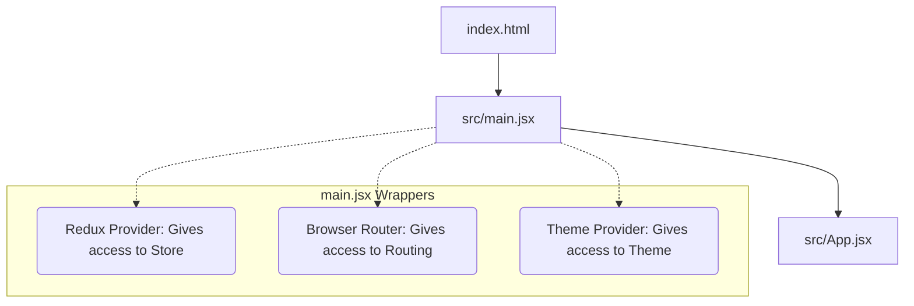
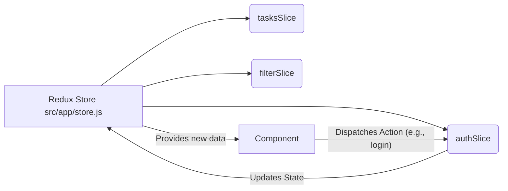
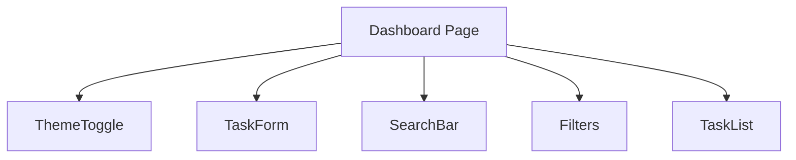

# Reverse Engineering Guide: Task Manager Pro

This guide is designed to help you understand exactly how `task-manager-pro` works under the hood. We'll break down the architecture so you can easily trace the flow of data and understand each file's purpose.

---

## 1. The Core Technologies
Before diving into the code, you need to understand the "Big 3" libraries this app relies on:
1. **React Router (`react-router-dom`)**: Handles moving between pages (Login -> Dashboard) without reloading the browser window.
2. **Redux Toolkit (`@reduxjs/toolkit`)**: The "global brain" of the app. It holds data (like tasks, user login state) so any component can access it without passing data down through multiple levels.
3. **React Context (`ThemeContext`)**: A simpler state manager used purely to handle the Light/Dark mode theme.

---

## 2. App Initialization Flow

When you run the app, here is the order in which files are executed:

- **`index.html`**: The single HTML page the browser loads. It has a `

`.
- **`src/main.jsx`**: The React starting point. It injects the React app into the `root` div. Notice how it wraps `<App />` in Providers (Redux, Router, Theme).
- **`src/App.jsx`**: Defines all the pages (routes) in your application.

---

## 3. Pages & Routing

Look inside `src/App.jsx`. You'll see routes mapping URLs to components:
- `/login` ➡️ `<LoginPage />`
- `/dashboard` ➡️ `<ProtectedRoute><Dashboard /></ProtectedRoute>`

### What is ProtectedRoute?
`src/components/ProtectedRoute.jsx` is a guard. It checks if the user is logged in (via Redux state).
- If **Yes**: It returns the `<Dashboard />` (the `children` prop).
- If **No**: It forces the user back to the `/login` page using the `<Navigate>` component.

---

## 4. How Data Flows (State Management)

The app manages data globally using **Redux Toolkit**. 

### Where to look:
1. **`src/app/store.js`**: The central vault. It combines all the "slices" of state together.
2. **`src/features/auth/authSlice.js`**: Keeps track of whether the user is logged in and their user details.
3. **`src/features/tasks/tasksSlice.js`**: Holds the array of task objects (title, status, id) and handles actions like adding, deleting, or toggling tasks.
4. **`src/features/filter/filterSlice.js`**: Holds the current filter status (e.g., "All", "Completed", "Pending") and search terms.

---

## 5. Component Interaction on the Dashboard

When a user reaches the `Dashboard`, several components work together:

- **`ThemeToggle.jsx`**: Uses `useContext(ThemeContext)` to flip the dark/light class on the `<body>`.
- **`TaskForm.jsx`**: Uses `useDispatch()` to send a "new task" to the Redux `tasksSlice`.
- **`SearchBar.jsx` & `Filters.jsx`**: Use `useDispatch()` to update the `filterSlice`.
- **`TaskList.jsx`**: Uses `useSelector()` to read all tasks and the current filters from Redux, computes which tasks to show, and renders them.

---

## 🚀 Recommended Reading Path

To reverse engineer this successfully, read the files in this exact order:

1. `src/main.jsx` (Understand the wrappers)
2. `src/App.jsx` (Understand the routes)
3. `src/components/ProtectedRoute.jsx` (Understand how auth guards work)
4. `src/app/store.js` (Understand the global data structure)
5. `src/features/auth/authSlice.js` (Understand how login/logout data is managed)
6. `src/pages/LoginPage.jsx` (See how a component triggers a login)
7. `src/pages/Dashboard.jsx` (See the main layout)
8. `src/features/tasks/tasksSlice.js` (Understand how tasks are added/removed)
9. `src/components/TaskForm.jsx` (See how new tasks are created)
10. `src/components/TaskList.jsx` (See how tasks are read from state and displayed)
